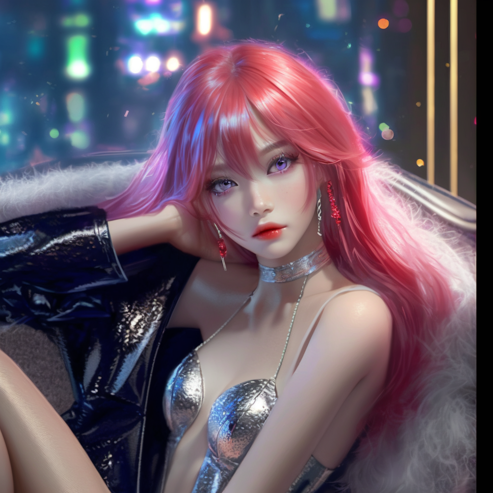

# Всем привет!
## Я Chikirao, программист из Питера. Изучаю [python](https://www.python.org/ "Оффициальный сайт"), [html](https://ru.wikipedia.org/wiki/HTML "Статья на Вики"), [css](https://ru.wikipedia.org/wiki/CSS "Статья на Вики").

### Интересуюсь нейронными сетями, генерирую картинки.

    

## Ссылки:
- ВК: https://vk.com/chikira0
- GitHub: https://github.com/Chikirao
- ТГ: https://t.me/Chikira0